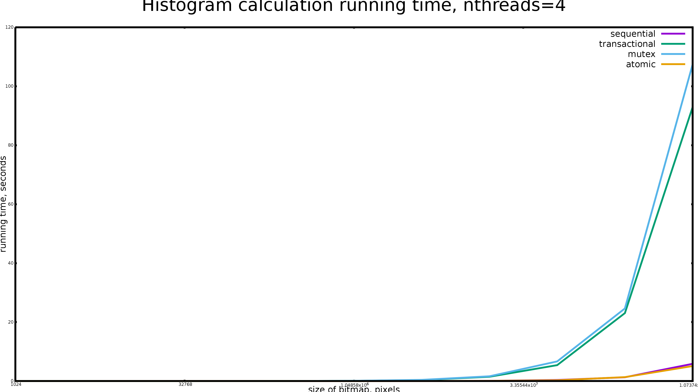
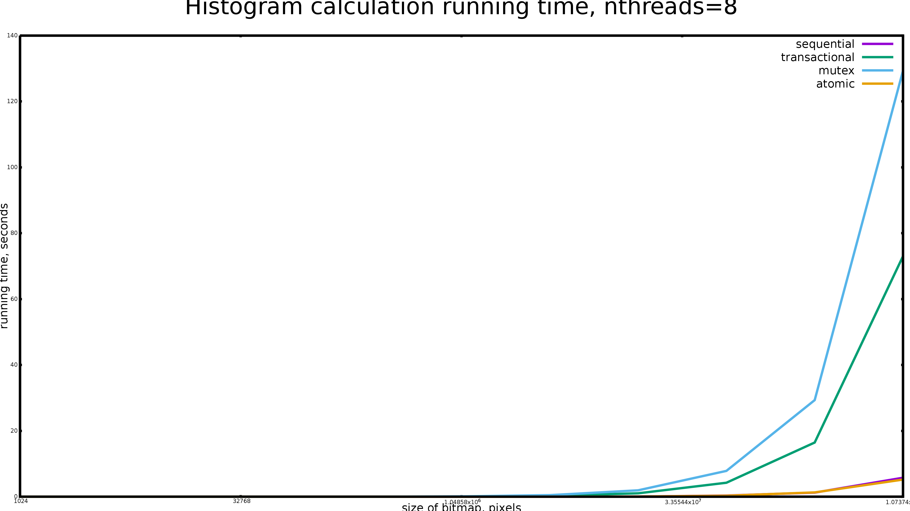

# cxx-histogram
Measuring performance of various synchronization primitives

This program runs the same calculation sequentially and concurrently using various synchronization primitives:

* Locks (std::mutex)
* Atomic variables (through GCC built-in `__sync_fetch_and_add`)
* Transactional Memory (through GCC TM library `__transaction_atomic` on Intel CPU with Intel TSX)

Some results can be found in [scripts/](./scripts/) directory:

