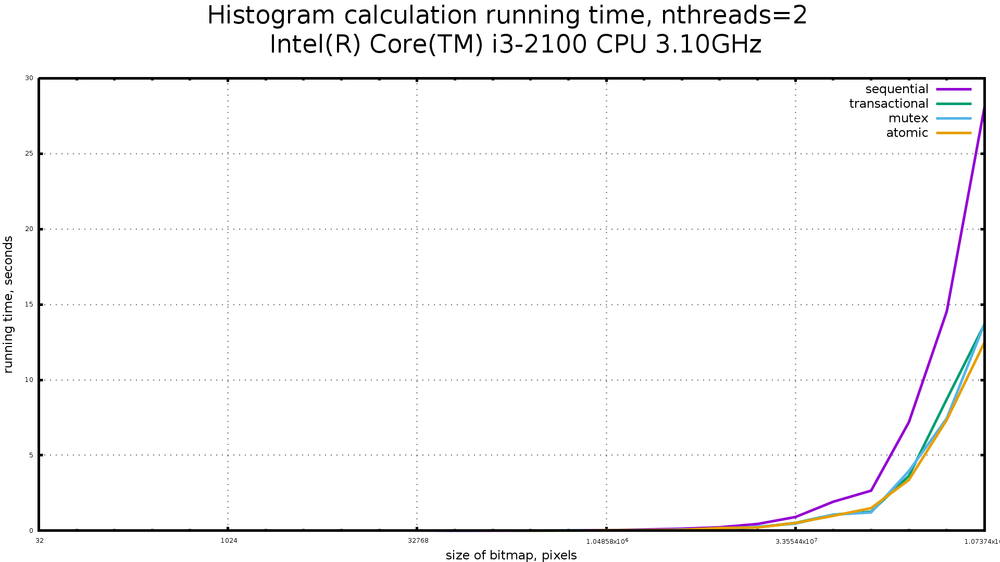
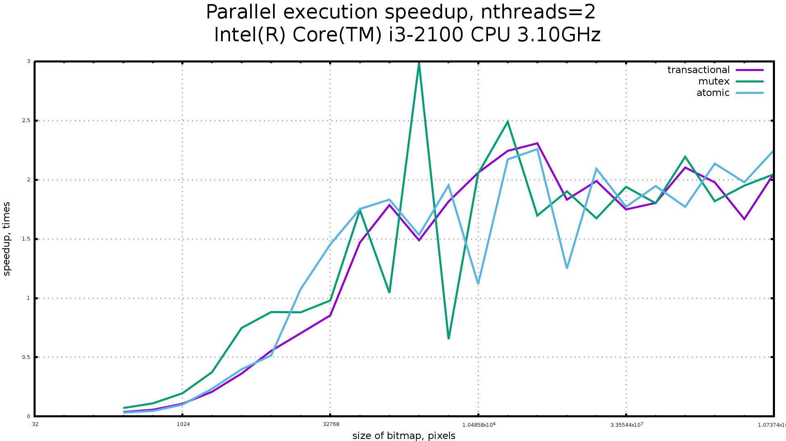

# cxx-histogram
Measuring performance of various synchronization primitives

## Description
This program runs the same calculation sequentially and concurrently using various synchronization primitives:

* Locks (std::mutex)
* Atomic variables (through GCC built-in `__sync_fetch_and_add`)
* Transactional Memory (through GCC TM library `__transaction_atomic` on Intel CPU with Intel TSX)

Actually, for this simple task difference in performance is negligible. Algorithm
of calculating histogram is the same for all examples. First, we calculate an
updates to histogram on local array for each running thread:

    using HistUpdateArray = std::array<int, histogram.size()>;
    HistUpdateArray calculate_updates(const bitmap& b, size_t start, size_t end)
    {
        auto updates = std::array<int, histogram.size()>{};
        for (size_t i = start; i < end; ++i) {
            auto bucket = static_cast<int>(luminance(b.pixels()[i]) / kBorder);
            ++updates[bucket];
        }
        return updates;
    }

Then, we use synchronization primitives to safely update a global histogram:

    void histogram_mutex(HistUpdateArray updates)
    {
        for (size_t i = 0; i < histogram.size(); ++i) {
            if (updates[i]) {
                std::lock_guard<std::mutex> lock{histogram[i].m};
                histogram[i].value += updates[i];
            }
        }
    }

## Results
Some resulting graphs and scripts to plot them can be found in
[scripts/](./scripts/) directory. Here are graphs for a few machines.

* hostname `alpha`

        Intel(R) Core(TM) i7-4770 CPU @ 3.40GHz
        8G RAM

* Running time, 8 threads

* Speedup, 8 threads

* hostname `gamma`

        Intel(R) Core(TM) i3-2100 CPU @ 3.10GHz
        8G RAM

* Running time, 2 threads

* Speedup, 2 threads

* Running time, 4 threads

* Speedup, 4 threads

